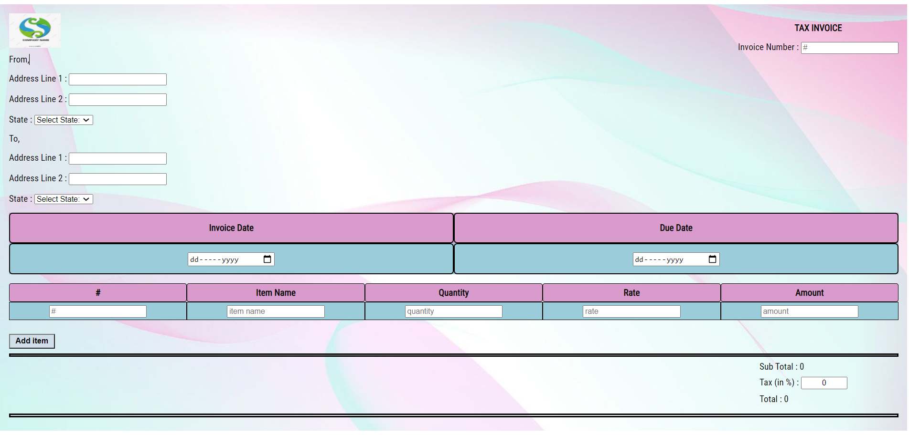
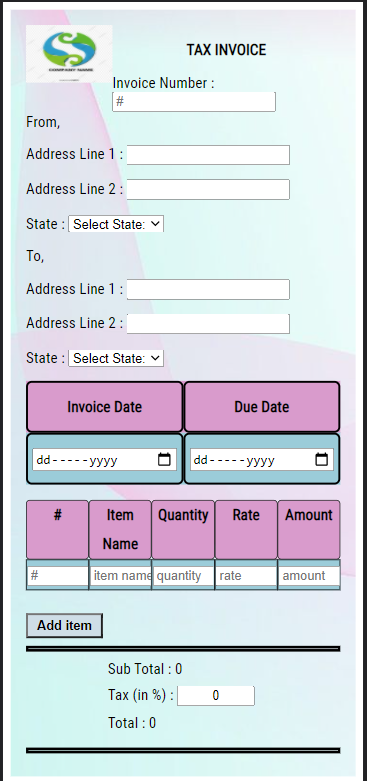

# Description

### This is an Invoice Generating website which is fully Responsive made with React JS and CSS styling components like Flexbox. It takes product(item) input from the user which could be multiple and then it asks to specify the quantity , unit price and then sums up the total cart value . It also has a Tax percentage field which asks if there are any tax included and then gives the Sub Total amount .

 

# Getting Started with Create React App

This project was bootstrapped with [Create React App](https://github.com/facebook/create-react-app).

## Available Scripts

In the project directory, you can run:

### `npm start`

Runs the app in the development mode.\
Open [http://localhost:3000](http://localhost:3000) to view it in the browser.

The page will reload if you make edits.\
You will also see any lint errors in the console.

 

## Desktop-Screen
 

 
 

##  Mobile-Screen
 

